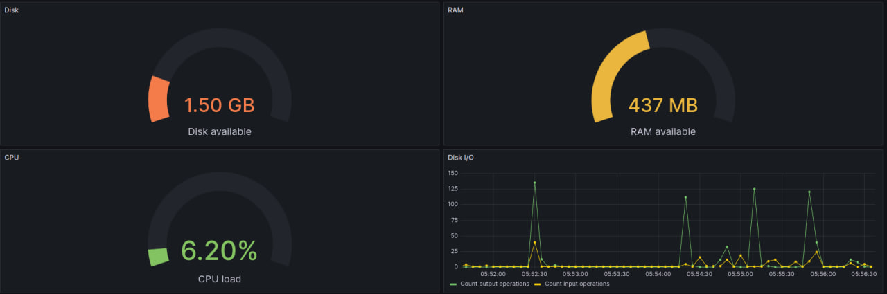
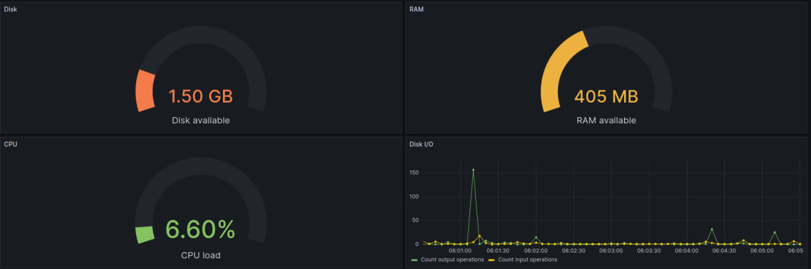
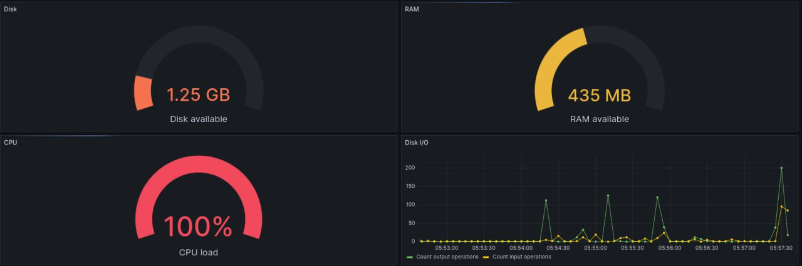

# Install
##### Install grafana
`sudo apt-get install -y adduser libfontconfig1`

`wget https://dl.grafana.com/oss/release/grafana_10.0.0_amd64.deb`

`sudo dpkg -i grafana_10.0.0_amd64.deb`

`rm -rf grafana_10.0.0_amd64.deb`
##### Install prometheus
`sudo apt install prometheus`
##### Activate grafana
`sudo systemctl start grafana-server`

######  Or autorun at system startup
`sudo systemctl enable grafana-server`

##### Activate prometheus
`sudo systemctl start prometheus`
###### Or autorun at system startup
`sudo systemctl enable prometheus`

##### Install stress
`sudo apt install stress`

# Settings Virtual box
Settings->Network->Advanced->Port forwarding
Add ports:
    grafana 3000
    prometheus 9090
    node-exporter 9100

# Grafana settings
Menu->Connections

Find prometheus

Prometheus server URL : http://localhost:9090

Save and test

Create a Prometheus data source

Menu->Dasboards->New->import

Import via panel json:

copy from 07_dashboard.json

Import

# Test

#### Test ex02

`cd ../02/ && ./main.sh abcdef qwerty.log 1Mb && cd ../07/`
##### Before test

#### After test

#### Test stress
`stress -c 2 -i 1 -m 1 --vm-bytes 32M -t 10s`
##### Before test

#### After test

